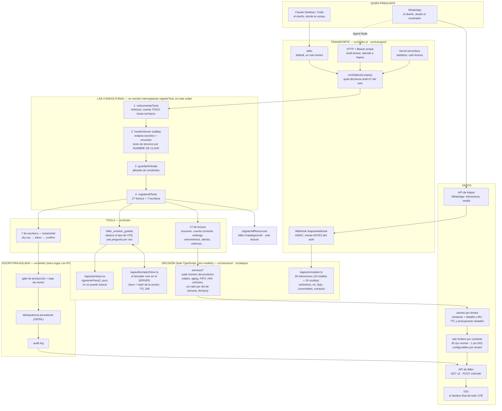

# EQUIPO.md — Cómo se profesionaliza, se opera y se hace crecer este proyecto

> Este documento contesta cinco preguntas: **cómo está estructurado** (con el
> diagrama completo), **de qué depende y qué tecnologías usa**, **cómo se deja
> funcionando**, **cómo se "entrena"** (y por qué esa palabra hay que usarla con
> cuidado acá), y **cómo se adapta a una empresa real de Biller**. Al final:
> el equipo de desarrollo (agentes + skills) y el plan de profesionalización
> por etapas.
>
> Los otros documentos siguen mandando en lo suyo: [`HANDBOOK.md`](HANDBOOK.md)
> para trabajar sin romper, [`ARQUITECTURA.md`](ARQUITECTURA.md) para el detalle
> de cada conexión, [`CALCULOS.md`](CALCULOS.md) para cada fórmula,
> [`BRAINSTORM_V3.md`](BRAINSTORM_V3.md) (§V5) para qué se construye después.

---

## 1. El diagrama completo



Tres cosas que el diagrama no puede decir y hay que saber:

1. **El orden de las envolturas es carga, no dibujo.** Las cuatro interceptan
   `server.registerTool`; moverlas después de `registerAllTools` las desactiva
   sin que falle nada visible. Es el error más caro del repo (HANDBOOK §4).
2. **La flecha GUIA↔STORE es la más nueva y la más importante**: el borrador de
   la emisión vive del lado del server. El texto que la barrera de salida no
   deja viajar por el modelo (conceptos, adenda) viaja server→store→server, y
   `biller_emitir_comprobante` lo completa desde ahí al armar el payload.
3. **El webhook entra ANTES del bearer auth** (viene de Meta, no de un cliente
   autenticado) y por eso su seguridad es otra: HMAC + allowlist + 404 sin
   secreto + rechazo con 200 para no confirmar nada a quien sondea.
4. **Cada tenant es dueño de su presupuesto y de sus detalles.** Los limiters y
   el cache LRU se construyen dentro de su `ToolContext`; una empresa no enfría
   ni agota la capacidad de otra.
5. **`biller://catalogos/cfe` es un MCP Resource**, no una tool: sirve el
   catálogo CFE local, determinístico y cacheable, sin tenant, red ni escritura.

---

## 2. Tecnologías y de qué depende qué

| Capa | Tecnología | Por qué esa y no otra |
|---|---|---|
| Lenguaje | TypeScript (strict) + Node ≥ 18 | El tipo cerrado es una barrera más: `NombreMetrica`, `Estrategia`, `PasoEmision` son uniones que no dejan inventar valores. |
| Protocolo | `@modelcontextprotocol/sdk` ^1.12 | MCP es lo que habla Claude (Desktop/Code) y el Agent Node de Kapso. |
| Validación | Zod v3 (3.25, trae `zod/v4` adentro) | Todo input de tool y toda respuesta de la API pasan por schema. **Deuda conocida:** el conversor v3 emite JSON Schema draft-07; el parche `transport/dialecto.ts` lo limpia del wire hasta migrar a `zod/v4` (V5.4). |
| Tests | Vitest | Suite automatizada sin red: la API se fake-ea en `tests/helpers.ts`. |
| WhatsApp | API de Kapso | Interactivos (botones/listas), media, webhook. El sandbox NO tiene templates: el push fuera de la ventana de 24 h espera eso. |
| Persistencia | Archivos JSONL append-only | Idempotencia (opt-out), audit, borradores (opt-in). No hay base de datos A PROPÓSITO: el volumen de una PyME (miles de CFE/año) no la justifica y cada dependencia de infra es una cosa más que se cae. |
| Deploy | proceso Node (stdio/HTTP) o Vercel (`api/`) | Serverless degrada a solo-lectura: la idempotencia en memoria no sobrevive entre invocaciones y un retry duplicaría una factura. |

**Cadena de dependencias en runtime** (qué necesita qué para funcionar):

```
biller_* (lectura)  → BILLER_API_BASE_URL + BILLER_API_TOKEN         (mínimo absoluto)
escritura           → + BILLER_CAPABILITY_MODE=write_enabled
ejecución real      → + BILLER_WRITE_ENABLED=true  (+ allow_production en prod)
approvals/WhatsApp  → + BILLER_APPROVAL_SECRET exclusiva del tenant
WhatsApp saliente   → + KAPSO_API_KEY + allowlist de destinatarios
WhatsApp entrante   → + transporte HTTP público + KAPSO_WEBHOOK_SECRET + allowlist de remitentes
multi-tenant        → + BILLER_TENANTS_JSON (overlay de env por empresa)
recarga multi-tenant → `kill -HUP <pid>` (valida y publica un snapshot atómico)
```

Cada flecha es opt-in: el server funciona con solo las dos primeras variables,
y cada capa que se suma trae su barrera. `node scripts/onboard.mjs` verifica la
cadena entera contra la API real (solo GET).

En HTTP multi-tenant, `SIGHUP` recarga el registro sin watcher ni endpoint de
administración: primero valida el archivo completo, luego descarta únicamente
contextos y sesiones de tenants eliminados, con configuración o credencial
cambiada, y por último publica el snapshot. Si la carga falla, sigue atendiendo
con el snapshot anterior.

---

## 3. Cómo dejarlo funcionando

**Local / un solo tenant (Claude Desktop):**

```bash
npm install && npm test            # suite sin red: si pasa, está sano
cp .env.example .env               # completar URL y token de TEST
node scripts/onboard.mjs           # verifica contra la API real, solo GET
# apuntar claude_desktop_config a dist/index.js (ver claude_desktop_config.example.json)
```

**WhatsApp (el producto completo):**

1. Transporte HTTP: `BILLER_TRANSPORT=http` + `BILLER_HTTP_AUTH_TOKEN` (32+ chars).
2. URL pública (túnel o deploy — Kapso rechaza localhost).
3. `node scripts/kapso-flow.mjs <url>/mcp` crea/actualiza el flow con el system
   prompt canónico de `docs/FLUJO_WHATSAPP.md` §5. **Nunca editar el prompt en
   el panel de Kapso**: el script es la única vía, para que el que corre y el
   documentado sean siempre el mismo.
4. Webhook: `KAPSO_WEBHOOK_SECRET` + `BILLER_REMITENTES_AUTORIZADOS`.

**La regla de oro del despliegue:** primero semanas contra `test.biller.uy` con
`write_enabled`; producción recién cuando el embudo `emision.paso` muestre
emisiones completas de punta a punta. Producción exige la doble llave
(`BILLER_ALLOW_PRODUCTION_WRITES=true` **y** `allow_production=true` por
operación) — eso es a propósito y no se "simplifica".

---

## 4. Cómo se "entrena" — y qué significa entrenar acá

Acá no hay pesos que ajustar: el modelo lo pone Claude/Kapso. Lo que se entrena
es **el sistema alrededor del modelo**, y en este orden de costo:

1. **Medir (ya existe).** `biller_metricas` + las líneas `"msg":"metrica"` del
   log: qué % cae en `desconocido`, dónde se abandona la emisión
   (`emision.paso`), cómo terminan (`emision.desenlace`).
2. **El benchmark (ya existe).** `npm run evals` corre el corpus de frases
   reales (`evals/corpus-enrutador.jsonl`) y da un **score comparable entre
   commits** — hoy 100%. La regla del equipo: un cambio al enrutador que baja
   el score no entra; una frase real nueva que falló en producción entra al
   corpus CON su origen. En CI puede correr como gate: `node
   scripts/evals-enrutador.mjs --min 95`.
3. **Achicar interfaces antes que promptear.** La evidencia interna: el modelo
   "se olvidaba" campos de la emisión porque la interfaz le exigía repetir 24
   campos por llamada; el store de sesión bajó eso a "mandá el dato nuevo".
   Cada campo menos en un schema es menos que el modelo puede errar.
4. **El system prompt del Agent Node** (`docs/FLUJO_WHATSAPP.md` §5) es el
   único prompt del sistema y se versiona acá. Se mejora contra fallas del
   corpus, no contra intuición, y se re-publica con `kapso-flow.mjs`.
5. **Fine-tuning: no, hasta tener tráfico real.** Con cero producción, entrenar
   con datos sintéticos hornea las suposiciones propias en un lugar donde ya no
   se ven ni se revierten. Los pasos 1–4 son días y se deshacen con git.

---

## 5. Cómo se adapta a una empresa de Biller

El diseño ya es multi-empresa; adaptar una empresa concreta es **configuración,
no código**:

| Paso | Qué | Dónde |
|---|---|---|
| 1 | Token de API de la empresa (primero el de test) | `BILLER_API_TOKEN` |
| 2 | Sucursal por defecto (Ajustes → Sucursales en biller.uy) | `BILLER_DEFAULT_SUCURSAL_ID` (+ `BILLER_SUCURSALES_JSON` con los nombres si hay varias) |
| 3 | Clave de approvals exclusiva del tenant | `BILLER_APPROVAL_SECRET` (mínimo 32 caracteres; `openssl rand -hex 32`) |
| 4 | Quién puede hablar por WhatsApp (el dueño, el contador) | `BILLER_REMITENTES_AUTORIZADOS` |
| 5 | A quién se le puede mandar (clientes para PDFs/recordatorios) | `KAPSO_DESTINATARIOS_PERMITIDOS` |
| 6 | Tope de monto por moneda (la red contra el error de coma) | `BILLER_MAX_MONTO_UYU`, `_USD` |
| 7 | Valor de la UI del día (para la regla de 5.000 UI) | `BILLER_VALOR_UI` + `_FECHA` |
| 8 | Verificar la cadena entera | `node scripts/onboard.mjs` |

**Varias empresas en un solo server:** `BILLER_TENANTS_JSON` — cada tenant es
un overlay de variables sobre las del proceso, y el `auth_token` del transporte
HTTP es a la vez credencial y selector de tenant. No existe un "header de
empresa": esa ausencia es la decisión de seguridad (la credencial no puede
mentir; un parámetro sí). Nada con estado (cache, idempotencia, métricas,
borradores) se comparte entre tenants.

**Checklist de alta de una empresa nueva** (el orden importa):
test primero → solo lectura dos semanas → mirar `biller_metricas` → habilitar
escritura en test → emisiones de prueba de punta a punta por WhatsApp →
producción con la doble llave → recordatorios de cobro al final (es lo único
que le escribe a TERCEROS, y estrena la allowlist de destinatarios).

---

## 6. El equipo de desarrollo

El "equipo" son siete agentes especializados versionados en
[`.claude/agents/`](../.claude/agents/) — cada uno carga las reglas de su área
para que no dependan de la memoria de nadie:

| Agente | Rol | Cuándo se invoca |
|---|---|---|
| **cto-arquitecto** | Decide DÓNDE va la lógica y defiende los 5 invariantes (el modelo no calcula, las envolturas, write/ aislado, nada compartido entre tenants, envoltura por nombre de clave). | Cambios que tocan más de un módulo; diseño de features; deuda técnica. |
| **guardian-fiscal** | Una sola pregunta: ¿puede esto producir un documento fiscal o un número de plata equivocado? Conoce los errores ya cometidos (punto de miles, montos_brutos, fecha uruguaya). | Antes de mergear cualquier cambio a write/, cálculos, o emisión. |
| **guardian-seguridad** | Las cuatro barreras + el canal de métricas + datos personales en disco. Piensa como atacante con una factura, un número de WhatsApp y los logs. | Cambios a security/, webhook, stores, logs, salidas. |
| **dev-conversacional** | El enrutador, los textos del almacenero y el corpus de evals. Su vara: `npm run evals` no puede bajar. | Intenciones nuevas, sinónimos, mensajes, fallas de comprensión. |

Los tres siguientes corren en **Fable** y son adversariales: no revisan que el
código respete lo escrito, buscan romperlo. Por eso su regla común es que un
hallazgo no existe hasta estar reproducido.

| Agente | Rol | Cuándo se invoca |
|---|---|---|
| **cazador-bugs** | Busca el número equivocado, el flujo trancado y la protección que protege de más. Reproduce ANTES de arreglar, y si la carrera es angosta la ensancha a propósito. | Algo "anda raro" sin stack trace; antes de mergear una ola grande. |
| **red-team-seguridad** | Ataca con objetivos concretos: que el modelo ejecute una instrucción de un tercero, que el token salga del proceso, que una empresa vea datos de otra. Conoce los lavados de barrera ya ocurridos. | Antes de exponer el server a internet o conectar el WhatsApp; cambios al borde de red, webhook o barrera de salida. |
| **flujo-kapso** | El camino completo como producto: qué botón, en qué orden, qué implica tocarlo, y qué pasa si el usuario contesta otra cosa. Su hallazgo estrella son los callejones sin salida. | Antes de conectar el Agent Node; al agregar un paso o un botón; "el bot se quedó callado". |

Y las **skills instaladas** (`.claude/skills/`, via `npx skills`):
`typescript-mcp-server-generator` (patrones MCP+TS, 12K installs, org oficial
de GitHub), `security-audit` (Cloudflare, 4K installs) y
`architecture-designer` (6K installs — diagramas, ADRs, trade-offs).
Complementan a los agentes: la skill trae el conocimiento genérico del dominio;
el agente trae las reglas de ESTE repo. Para buscar más: `npx skills find <tema>`.

**El flujo de trabajo propuesto** para cualquier cambio no trivial:

```
diseñar con cto-arquitecto → implementar → npm run typecheck && npm test &&
npm run check:readonly && npm run evals → revisar con el guardián que toque
(fiscal si hay plata, seguridad si hay salida/entrada) → mergear
```

---

## 7. El plan de profesionalización, por etapas

**Etapa 0 — Congelar lo que ya está (esta semana).**
Commitear el trabajo acumulado en commits por tema (hoy es un solo árbol sin
commitear). Sugerencia de cortes: barreras/seguridad · analítica (A2–A12) ·
canal WhatsApp (C1–C8) · store de borradores + sesión · métricas ·
V5 (repetir, en_flujo, evals) · docs. CI ya corre typecheck+tests+readonly;
agregarle `evals --min 95`.

**Etapa 1 — Un usuario real (próximas 2 semanas).**
Todo lo demás de este documento es hipótesis hasta que `enrutador.mensaje` y el
embudo tengan datos de producción. Una empresa, en test, solo lectura. El
trabajo del equipo esa quincena: mirar métricas y alimentar el corpus.

**Etapa 2 — Deuda que borra código.**
Migrar schemas a `zod/v4` (borra `transport/dialecto.ts`; hay un test que se
pone rojo solo cuando el SDK deje de necesitarlo). Extraer el preámbulo de
período repetido en ~10 tools. Unificar los dos `diasEntre` (vencimientos
exclusivo vs comparación inclusivo) en `services/fechaUy.ts` con nombres que
digan cuál es cuál.

**Etapa 3 — Crecer con los números adelante.**
V5.5 (cierre de mes proactivo, cuando haya templates) y V5.6 (foto de factura,
solo si las métricas muestran que la gente lo intenta). La regla que ordena
todo: **primero lo que acorta la conversación de emitir, después lo que hace
medible el resto, y lo proactivo recién cuando alguien real usó lo reactivo.**

---

## 8. Las reglas de la casa (resumen para el que llega)

1. El modelo no calcula ni un solo número. Si estás por promptear una decisión
   fiscal, va en código.
2. Todo POST fiscal del runtime hacia Biller vive en `src/write/`;
   `src/tools/write/` prepara y valida la operación.
   `npm run check:readonly` lo verifica; no se discute con el guard, se discute
   con el CTO. La única excepción que emite hacia Biller fuera del runtime es
   `scripts/contrato-post.mjs`: un
   probe externo, fuera del servidor, con doble opt-in y host fijado a TEST.
3. Toda funcionalidad transversal se monta interceptando `registerTool`.
4. Nada que vuelva a entrar en un payload usa las claves envueltas
   (`concepto`, `razon_social`, `adenda`…). El texto sensible viaja por el
   store de sesión, no por el modelo.
5. Los números que los documentos afirman sobre el código viven bajo test
   (`tests/conteosDoc.test.ts`). Si escribís "hay N tools" en un doc, el test
   te va a corregir.
6. Cada decisión rara lleva su porqué al lado, en el código. Si no podés
   escribir el porqué, la decisión no está tomada.
7. El corpus de evals solo crece. Una frase real que falló es una línea nueva,
   con origen. El score no baja.
