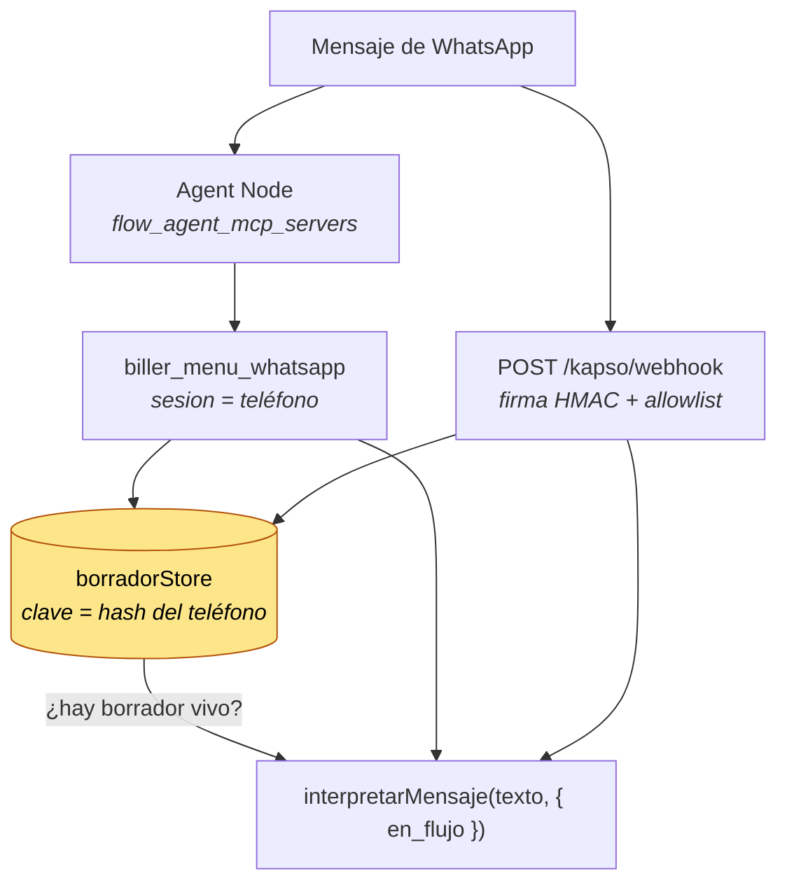

# Integración con Kapso (WhatsApp)

> Estado: implementado y verificado contra el sandbox real de Kapso (texto,
> lista interactiva, botones y PDF adjunto, 28/07). Falta armar el flow con el
> Agent Node — ver §6.
>
> **Este documento es la plomería**: cómo se conecta el server a Kapso, con qué
> tokens y desplegado dónde. La **conversación** —qué pasa cuando llega un
> "hola", cómo se emite con botones, cómo llega el PDF— está en
> [`FLUJO_WHATSAPP.md`](FLUJO_WHATSAPP.md), con el system prompt del Agent Node
> listo para copiar.

Hay **dos direcciones**, independientes entre sí, con arquitecturas de seguridad
opuestas. Se pueden habilitar por separado.

| | Inbound | Outbound |
|---|---|---|
| Qué hace | el dueño **pregunta** por WhatsApp y contesta el MCP | el sistema **avisa** solo |
| Quién inicia | el usuario | el server |
| Requiere | `BILLER_TRANSPORT=http` + URL pública | `KAPSO_API_KEY` + allowlist |
| Riesgo a controlar | autenticar la **entrada** | restringir la **salida** |

---

## 1. Inbound — preguntarle a Biller por WhatsApp

Los Agent Nodes de Kapso aceptan MCP servers externos vía `flow_agent_mcp_servers`.
Eso significa que **todas las tools que ya existen funcionan por WhatsApp sin
escribir una línea de lógica nueva**: el mismo código que contesta en Claude
Desktop contesta en el celular del dueño de la PyME.

### 1.0. La conversación tiene estado, y lo guarda el server

Hay **dos caminos de entrada** y los dos convergen en el mismo store:



**`sesion` es el parámetro que hace que el flujo no dependa del contexto del
modelo.** Se pasa en cada llamada a `biller_menu_whatsapp` y a
`biller_emision_guiada`, con el número del remitente:

| Con `sesion` | Sin `sesion` |
|---|---|
| El borrador de la emisión se **guarda y se fusiona**: la próxima llamada manda solo el dato nuevo | Vale el contrato viejo: "mandá TODO lo que sabés en cada llamada" |
| El server **deduce `en_flujo`** mirando si hay un borrador vivo | El agente tiene que acordarse de mandar `en_flujo`, y olvidarlo pierde la carga |
| Los conceptos de los ítems los completa el server al emitir | El agente tiene que copiarlos del historial de la conversación |
| El borrador se **descarta al emitir** (pasando `sesion` a `biller_emitir_comprobante`) | El borrador viejo sigue vivo 24 h y le mete su cliente a la próxima factura |

**El número no se guarda: se guarda un hash** (`claveSesion`). La sesión natural
es la conversación de WhatsApp, o sea el número — pero el número es un dato
personal de un tercero, y terminaría en un archivo en disco y en cada log de
error que mencione la clave. El hash es igual de estable entre mensajes, que es
lo único que se necesita.

**`en_flujo` derivado, y por qué dejó de ser un parámetro del agente.** Era un
booleano que el modelo tenía que recordar, y el modo de falla era silencioso:
en medio de una emisión, *"pará, eran 3 no 2"* con `en_flujo` olvidado cae en
`desconocido`, el webhook **autorresponde** el menú, y la carga a medio hacer se
pierde. Hoy lo leen del store tanto la tool como el webhook, y viene marcado en
la respuesta como `en_flujo_derivado: true`. El booleano explícito quedó como
override para el llamador que sepa algo que el store no.

**Que el webhook lea el store no viola su propia regla** (§2 de su encabezado:
"no ejecuta nada que toque plata"). Lo que no puede hacer es ejecutar algo que
mueva plata o que necesite un dato de Biller; mirar un borrador que este mismo
server guardó no es ni una cosa ni la otra.

⚠️ El store es **memoria por default**. El archivo
(`BILLER_BORRADOR_STORE_PATH`) es opt-in porque su contenido es información
comercial —qué se vendió, a quién, la adenda— y eso en disco es una decisión, no
una optimización. Los borradores vencen a las **24 h**: es la ventana de
servicio de WhatsApp, y una conversación más vieja que eso no se está
continuando, se está empezando de nuevo.

### 1.0.1. Replay de Meta/Kapso

Cada mensaje entrante se deduplica por el `message_id` ya normalizado por el
webhook. La reserva es atómica y ocurre antes de interpretar o ejecutar
efectos; un reintento ya reservado responde `200` sin volver a rutear ni
enviar. El estado tiene TTL y techo LRU para no crecer sin límite.

Por defecto el estado vive en memoria. Para sobrevivir reinicios se puede
configurar `BILLER_WEBHOOK_REPLAY_LOG_PATH`; con `BILLER_DATA_DIR` se deriva
automáticamente a `<data_dir>/<tenant>/webhook-replay.jsonl`, también en modo
mono-tenant (`_proceso`). El journal solo guarda digests de ids, con archivos
0600 y directorios 0700: nunca el cuerpo del webhook ni datos personales.

```dotenv
BILLER_WEBHOOK_REPLAY_LOG_PATH=./data/webhook-replay.jsonl
BILLER_WEBHOOK_REPLAY_TTL_MS=86400000
BILLER_WEBHOOK_REPLAY_MAX_ENTRIES=10000
```

Si el journal está corrupto o no se puede reservar, el webhook falla cerrado
con `503` y no interpreta el evento. Cada tenant conserva su propio store; una
recarga de configuración no reutiliza el store de otra configuración.

**La deduplicación es por proceso y por archivo.** Dos réplicas detrás de un
balanceador, cada una con su journal, deduplican por separado: el mismo reenvío
de Meta puede caer en la otra réplica y ejecutarse igual. Mientras no haya un
store compartido, el WhatsApp se atiende con **una sola instancia** (o con las
réplicas apuntando al mismo directorio en un filesystem compartido, que
coordina por locks `O_EXCL`). Si esto se vuelve una restricción molesta, lo que
cambia es la implementación del store —la interfaz `WebhookReplayStore` ya
existe—, no el resto del webhook.

### 1.0.2. Idempotencia de salidas

Cada salida a Kapso se reserva antes de tocar la red con una clave opaca que
liga empresa, actor, destinatario, operación y payload. Un timeout queda en
estado incierto y no se reintenta automáticamente. El journal es distinto del
fiscal y del replay entrante: `KAPSO_IDEMPOTENCY_LOG_PATH`, o la ruta derivada
`<data_dir>/<tenant>/kapso-idempotencia.jsonl` al configurar `BILLER_DATA_DIR`.
En serverless, las salidas se bloquean si no existe persistencia durable.

**La reserva es una VENTANA, y la ventana la decide la operación.** Sin eso, la
reserva no deduplica un reintento: condena al mensaje. La primera versión no
tenía noción de tiempo, así que el segundo mensaje byte a byte idéntico quedaba
bloqueado para siempre — y el segundo menú, o el primer paso de la segunda
factura del día, son idénticos al primero.

| Operación | Ventana | Por qué |
|---|---|---|
| `menu`, `resolucion`, `paso_emision` | sin reserva | Repetirlo no cuesta nada; bloquearlo deja el chat mudo. El reenvío de Meta ya lo corta el replay entrante. |
| `documento`, `media`, `reporte_diario`, `confirmacion_*`, `texto`, `interactivo` | 15 min (más el tramo anterior) | Un reintento por respuesta perdida ocurre en segundos; pasado eso, un mensaje idéntico es un pedido nuevo. |
| `recordatorio` | el día uruguayo | Dos mensajes de cobranza el mismo día empeoran la cobranza. El reenvío deliberado viaja como otra operación. |

Una salida que no sale por la reserva se loguea como
`kapso.salida.bloqueada_por_reserva`, con la operación y el motivo. Si ese
evento aparece seguido para operaciones conversacionales, la ventana está mal
calibrada: es la señal temprana de que alguien no está recibiendo respuesta.

### 1.1. El bloqueante y cómo se resolvió

Kapso rechaza URLs que resuelven a **localhost** (protección SSRF), y el server
era **stdio-only**. Se agregó transporte HTTP (`src/transport/http.ts`).

### 1.2. Arrancar el server en modo HTTP

```bash
export BILLER_TRANSPORT=http
export BILLER_HTTP_AUTH_TOKEN=$(openssl rand -hex 32)   # guardalo: lo necesita Kapso
export BILLER_API_BASE_URL=https://test.biller.uy
export BILLER_API_TOKEN=<tu-token-de-biller>
npm run build && npm start
```

El endpoint MCP queda en `http://127.0.0.1:8848/mcp`, y hay dos rutas sin
autenticación que no devuelven ningún dato del negocio:

| Ruta | Contesta |
|---|---|
| `/healthz` | Latido: `{"status":"ok","transport":"http"}` mientras el proceso viva. |
| `/readyz` | Preparación: `200 {"status":"listo"}`, o `503` con los NOMBRES de las variables que faltan. |

Son dos preguntas distintas y conviene no confundirlas: `/healthz` contesta 200
aunque el gate vaya a bloquear todos los POST por configuración incompleta, así
que un orquestador que solo mire liveness le manda tráfico a un server que no
puede facturar. `/readyz` usa la MISMA lista que el gate, así que no puede decir
"listo" mientras el gate bloquea. En ambiente `test`, o sin escrituras
habilitadas, siempre da 200: ahí no hay POST real que trancar.

**Sin `BILLER_HTTP_AUTH_TOKEN` el server no arranca.** No es tolerante como la
config de Biller: un endpoint HTTP sin credencial expone la contabilidad entera
a quien encuentre el puerto.

### 1.3. Darle una URL pública

`127.0.0.1` es el default a propósito. Dos caminos:

**Túnel (desarrollo):**

```bash
cloudflared tunnel --url http://localhost:8848
```

**Vercel (producción)** — ver §1.6. Es el camino elegido.

Si en cambio corrés el proceso vos mismo, poné un reverse proxy con TLS.
**No pongas el proceso directamente en `0.0.0.0` sin TLS**: el bearer viajaría
en texto plano. El server lo advierte en el log si detecta esa configuración.

### 1.4. Configurar el Agent Node

```json
{
  "flow_agent_mcp_servers": [
    {
      "name": "biller",
      "url": "https://<tu-tunel>.trycloudflare.com/mcp",
      "headers": { "Authorization": "Bearer ${ENV:BILLER_HTTP_AUTH_TOKEN}" }
    }
  ]
}
```

Kapso soporta `${ENV:KEY}` en headers: **cargá el token como variable de entorno
del proyecto, no lo pegues literal en el JSON del flow.**

### 1.5. Deploy en Vercel

```bash
vercel --prod
```

El endpoint MCP para Kapso queda en `https://<tu-deploy>.vercel.app/api/mcp`.

Variables a cargar en el panel de Vercel (**nunca en un archivo**):

| Variable | Obligatoria |
|---|---|
| `BILLER_API_BASE_URL` | sí |
| `BILLER_API_TOKEN` | sí |
| `BILLER_HTTP_AUTH_TOKEN` | sí (`openssl rand -hex 32`) |
| `KAPSO_API_KEY`, `KAPSO_PHONE_NUMBER_ID`, `KAPSO_DESTINATARIOS_PERMITIDOS` | solo para el push |

#### Lo que cambia en serverless — leer antes de desplegar

Vercel congela o destruye el proceso entre invocaciones, y cada request puede
caer en una instancia distinta. Nada en memoria sobrevive de forma confiable.
Tres consecuencias reales:

1. **Modo stateless.** El transporte no emite `mcp-session-id`: un id emitido
   por una instancia no lo conoce la siguiente, y el cliente recibiría 404 en la
   segunda llamada. Con stateless cada request es independiente — que es
   exactamente el patrón de uso de Kapso.

2. **La escritura se DEGRADA a `read_only` automáticamente.** La idempotencia
   vive en memoria y en serverless no sobrevive; un reintento —rutina en
   serverless, no excepción— podría emitir dos veces la misma factura ante DGI.
   Para asumirlo igual hace falta `BILLER_SERVERLESS_ALLOW_WRITES=true`, cuyo
   nombre dice lo que estás aceptando. **La recomendación es dejar Vercel en
   read_only** y hacer la escritura desde un proceso con disco.

3. **`BILLER_AUDIT_LOG_PATH` y `BILLER_IDEMPOTENCY_LOG_PATH` no funcionan**: el
   filesystem es de solo lectura. El audit igual sale por stderr y Vercel lo
   captura en sus logs.

4. **El store de borradores en memoria no sirve** (§1.0). Un contexto nuevo por
   request significa que cada mensaje del usuario arrancaría de cero: `sesion`
   no recuperaría nada y el flujo de emisión volvería al contrato viejo, justo
   donde más se nota. El archivo tampoco alcanza —`/tmp` no se comparte entre
   instancias—. **Para el flujo de emisión por WhatsApp, el transporte que
   corresponde hoy es el HTTP largo.**

`/api/healthz` responde sin autenticación y devuelve solo booleanos de
configuración — nunca valores.

### 1.6. Verificar

```bash
curl -s http://127.0.0.1:8848/healthz
curl -s -o /dev/null -w '%{http_code}\n' http://127.0.0.1:8848/readyz
```

```bash
curl -s -X POST http://127.0.0.1:8848/mcp -H "authorization: Bearer $BILLER_HTTP_AUTH_TOKEN" -H 'content-type: application/json' -H 'accept: application/json, text/event-stream' -d '{"jsonrpc":"2.0","id":1,"method":"initialize","params":{"protocolVersion":"2024-11-05","capabilities":{},"clientInfo":{"name":"test","version":"1"}}}'
```

---

## 2. Outbound — que el sistema avise solo

**Siete tools** mandan mensajes, todas con la misma barrera (allowlist de
destinatarios):

| Qué manda | Tool | Tipo de mensaje |
|---|---|---|
| El digest operativo | `biller_reporte_diario` (`enviar=true`) | texto |
| El menú de opciones | `biller_menu_whatsapp` (`enviar=true`) | interactivo (lista) |
| Los botones de desambiguación de un empate | `biller_menu_whatsapp` (`enviar=true`, `via="ambiguo"`) | interactivo (botones) |
| La pregunta del paso actual de la emisión | `biller_emision_guiada` (`enviar=true`) | interactivo (botones o lista de clientes) |
| "¿Cuál de estos clientes?" | `biller_resolver_nombre` (`enviar=true`, resultado ambiguo) | interactivo (botones) |
| El preview de una emisión | `biller_emitir_comprobante` (`confirmar_por_whatsapp`) | interactivo (3 botones) |
| El PDF de un CFE | `biller_enviar_comprobante_whatsapp` | documento adjunto |
| El reclamo de una deuda | `biller_recordatorio_cobro` | texto, con ciclo dry-run → token → confirm **y** allowlist |

**Todos estos mensajes los arma el server, no el modelo.** Es la misma razón en
los siete casos: el cuerpo lleva importes, y un mensaje redactado por el modelo
podría decir un número distinto del que se calculó sin que nadie lo note. El
agente pide que se manden; no los escribe. Ver
[`FLUJO_WHATSAPP.md`](FLUJO_WHATSAPP.md) §3.0.3.

`biller_reporte_diario` arma el digest (urgente → cobranzas → facturación) y
puede enviarlo por WhatsApp.

```bash
export KAPSO_API_KEY=<api-key-del-proyecto>
export KAPSO_PHONE_NUMBER_ID=<id-del-numero-emisor>
export KAPSO_DESTINATARIOS_PERMITIDOS=59899123456
export BILLER_APPROVAL_SECRET=<clave-aleatoria-exclusiva-generada-con-openssl-rand-hex-32>
```

`BILLER_APPROVAL_SECRET` es obligatoria al activar Kapso porque el recordatorio
de cobro usa un approval firmado antes de escribirle a un tercero. Debe ser
distinta de la API key de Kapso y exclusiva de este tenant.

### 2.1. El envío es opt-in y con allowlist

Por defecto la tool **solo devuelve el texto**. Enviar requiere `enviar: true`
**y** que el destinatario esté en `KAPSO_DESTINATARIOS_PERMITIDOS`.

La allowlist no es una comodidad de configuración. El mensaje lleva montos, RUTs
y nombres de clientes. El número de destino podría venir de un campo de texto de
un comprobante (que escribe un tercero), de una alucinación del modelo, o de un
dígito mal copiado. **Con allowlist, esas tres cosas son un error de validación;
sin allowlist, son una fuga de datos fiscales a un desconocido.**

Un destinatario bloqueado no genera **ninguna** conexión de salida: el chequeo
va antes de construir la request.

### 2.2. Envío automático sin volverse ruido

```json
{ "enviar": true, "destinatario": "59899123456", "solo_si_hay_novedades": true }
```

Con `solo_si_hay_novedades`, si no hay nada que atender no se manda nada. Un
digest que llega todos los días sin novedad se deja de leer a la segunda semana
— y entonces el día que sí importa tampoco se lee.

---

## 3. Qué se probó y qué no

| | Estado |
|---|---|
| Transporte HTTP: initialize → sesión → `tools/list` → `tools/call` | ✅ verificado contra el server real |
| Rechazo sin token / con token inválido / sin token configurado | ✅ 401 / 401 / 403 |
| `/healthz` sin auth y sin datos del negocio | ✅ |
| Webhook: firma HMAC en tiempo constante, allowlist antes de interpretar, 200 siempre | ✅ `tests/kapso.test.ts` |
| `en_flujo` derivado del borrador vivo, en la tool **y** en el webhook | ✅ `tests/revisionMostrador.test.ts` |
| El borrador se fusiona, se recupera lo que no vino y se descarta al emitir | ✅ `tests/emisionGuiada.test.ts` |
| Allowlist de destinatarios (incluye "no genera tráfico de red") | ✅ `tests/kapso.test.ts` |
| Armado del digest y su límite de tamaño | ✅ |
| Interactivos, subida de media y documento adjunto | ✅ `tests/kapso.test.ts` y `tests/whatsappFlujo.test.ts` — ver [`FLUJO_WHATSAPP.md`](FLUJO_WHATSAPP.md) §7 |
| Cliente de Kapso contra la API **real** | ✅ texto, lista interactiva, botones y documento (sandbox, 28/07) |
| Agent Node de Kapso conectado a este MCP | ❌ **no probado** — ver §5 |

Los tests del cliente de Kapso usan un `fetch` inyectado, pero la forma de la
request **ya no sale solo de la documentación**: los cuatro tipos de mensaje se
mandaron contra el sandbox real el 28/07 y volvieron con `message_id` (y con
`media_id` el documento). Ver [`FLUJO_WHATSAPP.md`](FLUJO_WHATSAPP.md) §7.1.

---

## 4. Sandbox: lo que no se puede probar ahí

| Capacidad | Sandbox | Producción |
|---|---|---|
| Texto e interactivos | ✅ | ✅ |
| Templates | ❌ | ✅ |
| Envío batch | ❌ | ✅ |

Consecuencia de diseño: **el push proactivo fuera de la ventana de 24 h de
WhatsApp necesita templates**, y los templates no existen en sandbox. El digest
automático de las 8 AM solo va a funcionar de verdad con una cuenta de
producción. En sandbox se valida el flujo completo, no el horario.

---

## 5. Tu número de prueba

El número que pasaste, `+598095923567`, lleva el **prefijo nacional 0** que en
formato internacional NO va:

| | |
|---|---|
| Como se marca en Uruguay | 095 923 567 |
| Como lo pasaste | +598 095923567 → `598095923567` (12 dígitos) |
| **Formato correcto (E.164)** | **`59895923567`** (11 dígitos) |

Ya quedó configurado así en tu `.env` local (que está gitignoreado). Si se
cargara con el 0, el envío se rechazaría como "destinatario no autorizado" sin
más explicación — por eso `advertenciasDestinatarios()` detecta ese patrón y lo
reporta en `biller_health_check` con el número enmascarado.

---

## 6. Lo que falta para cerrar

1. ~~**Credenciales de un proyecto de Kapso.**~~ ✅ Listo: el cliente habló con
   la API real el 28/07 (texto, lista interactiva, botones y PDF adjunto).
2. ~~**Activar el número en el sandbox.**~~ ✅ Listo.
3. **Armar el flow con el Agent Node.** Ya no es a mano: `scripts/kapso-flow.mjs`
   lo crea vía la Platform API (`https://api.kapso.ai/platform/v1`), leyendo el
   system prompt de [`FLUJO_WHATSAPP.md`](FLUJO_WHATSAPP.md) §5 y activando el
   trigger `inbound_message` para `KAPSO_PHONE_NUMBER_ID`. Lo único que le falta
   es la **URL pública** del MCP, que Kapso exige que no resuelva a localhost.

   ```bash
   ngrok http 8848
   node scripts/kapso-flow.mjs https://<host>/mcp
   ```

   Solo un workflow puede tener el trigger activo por número, así que correrlo
   dos veces actualiza el que hay en vez de duplicarlo.
4. **Templates de WhatsApp** para el digest proactivo real (§4). Requiere cuenta
   de producción de Kapso, que todavía no hay — el sandbox alcanza para validar
   el flujo completo dentro de la ventana de 24 h.
